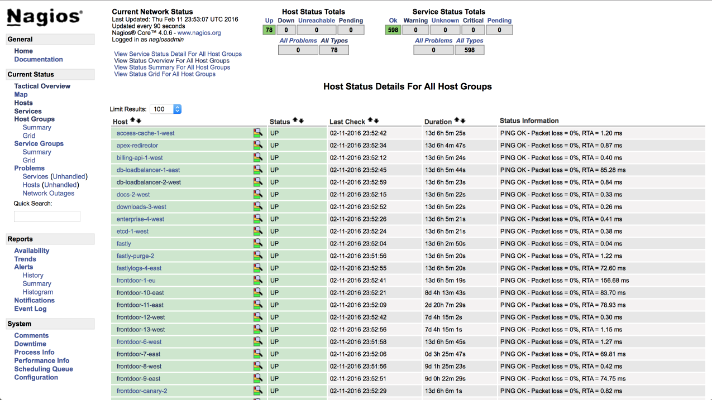
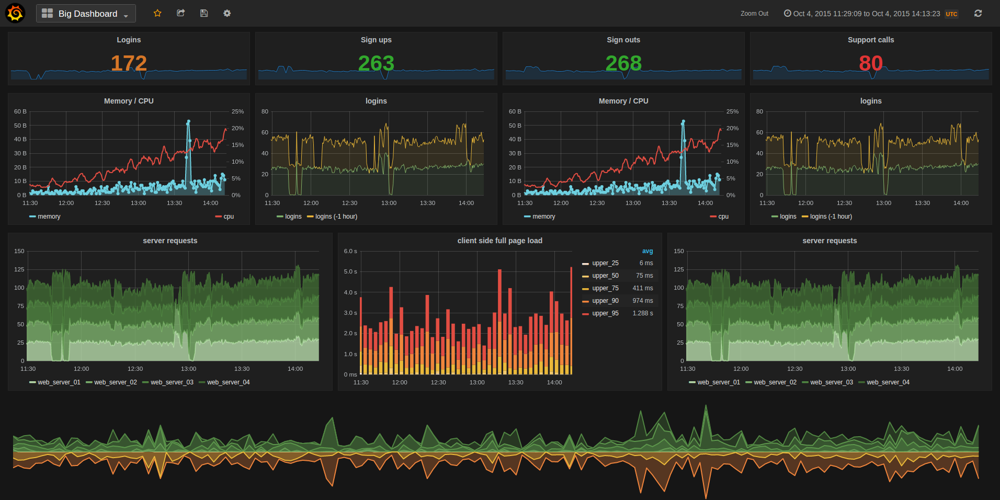
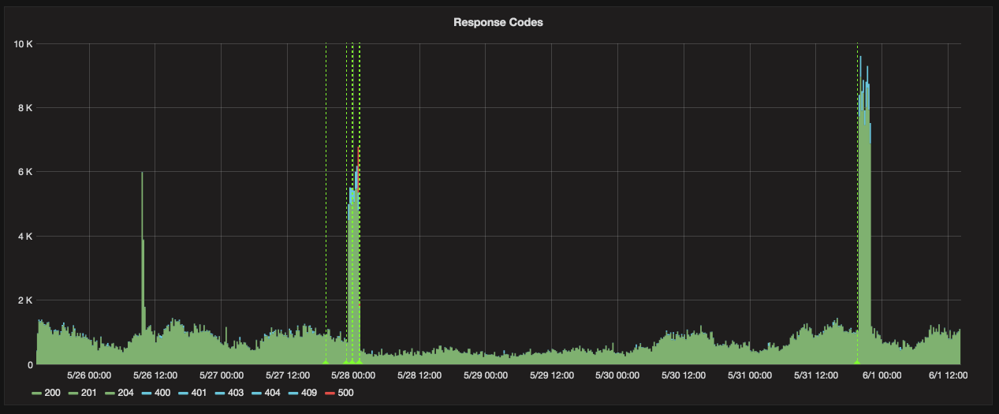
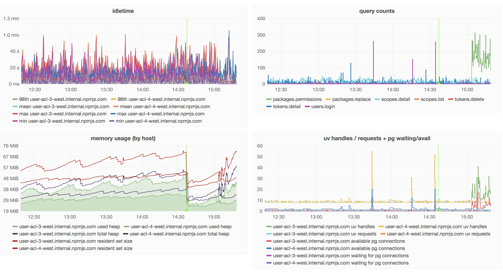

# [fit] monitoring
# [fit] on a __budget__

---

# [fit] a few animated gifs
# [fit] with the Twelfth Doctor (0 cats)

^ There will be a few scattered animated gifs in my slides, as the 12th Doctor accompanies me.

---


# [fit] C J Silverio
## [fit] vp of engineering, 

## [fit] __@ceejbot__

^ How many of you have ever used npm to install something? How many of you use it daily? Yeah, that's a lot of you. I'm going to talk about how I know you can install things.

---


# [fit] let's talk __npm__
# [fit] by the numbers

---

# [fit] 205 __million__ packages Tuesday
# [fit] __10K__ requests/sec

^ 205 million packages were downloaded on Tuesday. We're at 1 billion over the last week, and Monday was a US holiday.  That's starting to scale! Surely, CJ, you have a big team!

---

# [fit] npm is __25__ people
# [fit] __4__ of us run the registry

^ That's a tiny number of people supporting a lot of you all.

---

# [fit] when the company was formed
# [fit] __5__ people total

^ We have 25 people now. When we started, it was 14 million / day with 5 people. Total. Most companies with services this large got there slowly and have staff to match. Not npm.

---

# [fit] you outsource many services
# [fit] when you're __tiny__

^ Because they're not your core competency, and you need to focus on building something your users want.

---

# [fit] you pull them back in-house
# [fit] when you __succeed__

^ You outgrow them. Usually by then you have a larger team and some revenue or funding.

---

# [fit] success is sometimes
# [fit] a __catastrophe__

^ Especially when you're a hobby project gone viral, only recently turned into a real company.

---

# [fit] npm's scale: runaway __success__
# [fit] npm's staff: wouldn't this be __neat__

^ Disparity.

---

# [fit] mission: know this
# [fit] on a __budget__

^ Everybody loves a challenge, right?

---


^ Lots of challenges here, but I'm going to concentrate on one of them: how we know we're up & running.

---

# [fit] 2 questions:
# [fit] is the registry __up__?
# [fit] how well is it __performing__?

^ Two jargon words for each of those questions.

---

# [fit] is the registry up?
# [fit] __monitoring__

^ Very easily answered questions.

---

# [fit] how well is it performing?
# [fit] __metrics__

^ Numbers and data that are application-specific.

---

# [fit] __monitoring__

---

# [fit] monitoring == __pull__
# [fit] ask questions that you
# [fit] know the right answers for

^ Pull: the monitoring server knows what's supposed to be out there, because you told it what to look for.

---

### [fit] Is this host __up__?
### [fit] Is this cert about to __expire__?
### [fit] Is the DB replication __keeping up__?

^ Yes/no questions.

---

# [fit] if you get the wrong answer
# [fit] somebody gets __paged__

---

# [fit] __nagios__
# [fit] state of the art in free

^ Trigger warning for web developers for the image I'm about to show.

---



^ This is awful information design. The depressing thing is it works.

---


# [fit] It's okay. We never look at it.
# [fit] It just triggers __Pager Duty__.

^ Breathe.

---

# [fit] nagios’s virtues:
# [fit] __reliability__ & __custom__ checks

^ is couchdb replicating? are our CDN's error rates low? Are we getting too many issues on our public issue tracker?

---

# [fit] goal: __never__ page anybody

^ Getting paged is stressful. We want it to be for real outages.

---

# [fit] self-healing checks
# [fit] __automate__ the fix if you can!

^ Hot budget tip! Don't involve a human. If your check can fix the bad condition, it should do so! Nobody needs to wake up. E.g. couchdb replication failure can be automatically fixed.

---

# [fit] monitoring == __unit tests__
# [fit] a ratchet for continuous improvement

^ You prevent yourself from having that bug again. After every production incident, we add monitoring.

---

# [fit] __external__ monitoring
# [fit] ping services

^ We pay for this, because it's the most reliable way to get paged if we're down from the outside.

---

# [fit] you __must__ monitor
# [fit] but that's just the start

---

# [fit] monitoring tells you __what__
# [fit] it doesn't tell you __why__

^ For that you need...

---

# [fit] __metrics__

^ Metrics.

---

### [fit] Q: What's a metric?
### [fit] A: A __name__ + a __value__ + a __time__.

^ Stored in timeseries databases, which are built around the idea that you'll be fetching data based on time ranges.

---

# [fit] __counter:__ it happened __N__ times
# [fit] __gauge:__ it's __Y__-sized right now
# [fit] __rate:__ it's happening __N__ times/second
# [fit] __timing:__ it took __X__ milliseconds

^ counter / gauge / rate / time - these all have meaning in the context of your application.

---

# [fit] metrics == __push__
# [fit] the app gives you numbers

^ sometimes surprising ones

---

# [fit] __emit__ from a service
# [fit] __store__ in timeseries db
# [fit] __query__ & graph

---

# [fit] the usual stack
# [fit] statsd ➜ graphite ➜ grafana

^ State of the art in free. Statsd collects metrics formatted a specific way, aggregates a bit, and stores them in graphite. At your leisure, you look at graphs in grafana.

---



^ This is grafana.

---


^ I didn't like the state of the art. I am fussy.

---

# __statsd__ uses UDP


---

# [fit] Q: Why not send metrics over UDP?
## [fit] A: You care about __receiving__ them.

^ I'd tell you a UDP joke, but I'm not sure you'd get it. How about when your system is stressed?

---

# just try to install __graphite__


---

# [fit] for-pay/SAAS services exist
# [fit] but I can't afford them

^ They charge by volume and I have a lot of volume. NewRelic. Rising Stack has an awesome node monitor service in beta.

---

# [fit] monitoring __400__ processes right now
# [fit] __12+ GB__ of log data a day

^ For-pay services charge by volume, and volume is what the registry has. Those 12G are just logs from our CDN, btw-- many multiples of that if we include server logs.

---

# [fit] interlude:
# [fit] when __should__ you pay?

---

# [fit] convert the __£$€__ cost
# [fit] into engineer hours/month

^ TIME. To get the same results, how much time would you have to spend to get the results from that service? Are you okay with the half-decent version you get doing it yourself? Are you ready to devote an engineer?

---

# [fit] pay when it's __cheaper__ than
# [fit] investing an engineer
# [fit] \(be __honest__ about the cost)

^ Here, I had a clear case of better to build, and I wanted a new side project anyway.

---

## [fit] __numbat__ was born

### [fit] “How hard can it be?” I said.

^ I wrote a manifesto with block diagrams and things. It was very blue-sky. Weirdly this is pretty much what I ended up building.

---


^ Turned out okay. Been in production about 18 months.

---

## https://github.com/numbat-metrics
### __n__umbat - __p__owered __m__etrics

^ replaces statsd & its clients and it does a lot of OS & db-specific monitoring too!

---


^ We have a thing about cute Australian marsupials at npm. Don't ask me why.

---

# [fit] npm’s stack
# [fit] numbat ➜ __influxdb__ ➜  grafana

^ Influx is our timeseries db.

---

```js
var Emitter = require('numbat-emitter');

var emitter = new Emitter({
    uri: 'tcp://localhost:3333',
    app: 'www',
});

process.emit('metric', { name: 'request.latency', value: 30 });
process.emit('metric', { name: 'disk.used.percent', value: 36 });
process.emit('metric', { name: 'login' });
```

^ Every service npm runs in production has an emitter. Every host has a collector.

---

# [fit] so easy to emit a metric
# [fit] that we just do it any time
# [fit] something __interesting__ happens

---

# [fit] __4000__ metrics/sec
# [fit] from the registry

---



^ See some spikes? We flushed a cache last night!

---


^ These are not just pretty graphs! These four charts show a problem with a service we'd just started sending traffic to. Latencies shot up!

---


---



^ The answer is here, in this second screenshot from the same page of graphics. The number queries used to answer handle that route was too high-- needed a redesign behind the scenes. Which we did. We spotted a db problem before we had it. Yay metrics! But wait. There's more.

---

# [fit] metrics ➜ __alerts__

^ We've got a metrics analyzer yelling at very low latency into a slack channel when certain metrics go out of bounds. All it takes to make this happen is a little javascript.

---

# [fit] Server handling __expected__ traffic?
# [fit] Latency higher than __normal__?
# [fit] Error rate higher than __usual__?

^  Your metrics know, and can yell if you vary from it.

---

# [fit] metrics comprise a __data stream__
# [fit] send the stream to more than one place!

^ To your timeseries db. To a process that does nothing but analyze them!

---


# [fit] __anomaly__
# [fit] __detection__

^ Humans are really good at this: we are walking pattern detection engines. You looked at that chart and saw a pattern & a violation of the pattern, and you asked a question about it. My stretch goal. Big companies like Twitter & Netflix have teams bigger than my entire registry team working on this.

---


# [fit] __recap__ time!

---

# [fit] your web apps are
# [fit] backed by __something__

---

# [fit] what's it up to?
# [fit] how do you know?

---

# [fit] __get data__ on what
# [fit] your services are up to

---

# [fit] what: __monitoring__
# [fit] yes/no questions

^ Bread & butter. Do not do anything else until you can answer these.

---

# [fit] why: __metrics__
# [fit] data changing over time

^ Get answers to questions you didn't know you had.

---

# [fit] next: __anomaly detection__
# [fit] predictions & trends

^ Statistical analysis of those numbers.

---

# [fit] __automate__
# [fit] don't require humans

^ You can do it without breaking the bank.

---


# [fit] `npm install -g npm@latest`
# [fit] __@ceejbot__ on all the things
# [fit] npm loves __you__

^ upgrade!
