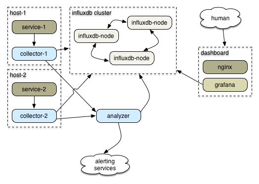
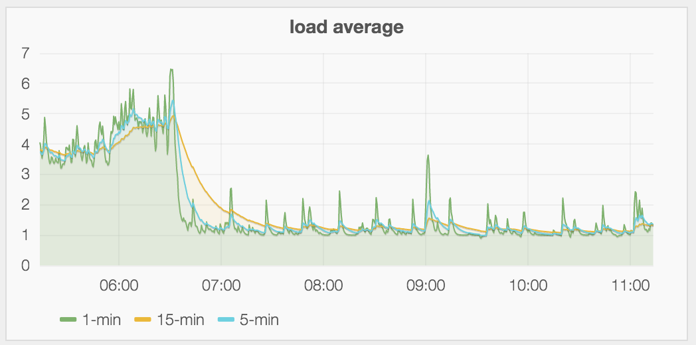

## monitoring the
## npm registry
## on a *budget*

---

# nagios

solving the problem of the 90s
with the technology of the 90s

---


^ This is awful information design

---

Nagios is very simple & reliable. The checks have a very simple API:

Print out a message, then exit with a status code.

exit 0: okay
exit 1: warning
exit 2: critical
exit 3: unknown

^ We have lots of custom checks.

---

## Nagios != visibility.

it's on/off: is this system responding?
it doesn't attempt to tell you *why*
something is happening.

---

## to tell you *why*
## you need metrics

---

# Q: What's a metric?

---

### Q: What's a metric?
### A: A name + a value + a time.

---

## kinds of metrics

*counter*: this thing happened 10 times
*timing*: this thing took X milliseconds to do
*gauge*: this thing is Y sized right now
*rate*: this thing is happening N times per second

---

## examples

`response.latency` 259ms @ 5:35pm

`response.latency` 192ms @ 5:36pm

`memory` 1.5GB @ 5:37pm

---

The canonical way to do this:

emit metrics from each process
statsd --> graphite

statsd is unconfigurable & uses udp
graphite is hell to set up & run

---

Why don't you want to send metrics over udp?

Well, do you care about getting them?
How about when your system is stressed?

---

## numbat was born

### "How hard can it be?" I said.

---



^ Weirdly this is pretty much what I ended up building.

---

## numbat-emitter

```js
var Emitter = require('numbat-emitter');

var emitter = new Emitter({
    uri: 'tcp://localhost:3333',
    app: 'www',
});

process.emit('metric', { name: 'httpd.latency', value: 30 });
process.emit('metric', { name: 'disk.used.percent', value: 36 });
process.emit('metric', { name: 'heartbeat' });
```

^ Every service npm runs in production has one of these.

---

## emitter conveniences

* every metric has a *host* field with the hostname
* if you don't provide a *value* it defaults to *1*
* you don't need to hold onto the emitter object!
* just emit *metric* events on the `process` global

---

It's so easy to emit a metric
any time something interesting happens
that you should just do it

---

# things that emit metrics

* forza - disk space, cpu, memory  use
* numbat-redis: polls redises for stats
* numbat-haproxy: polls haproxies for stats
* cron jobs that monitor couchdb
* every node process we run

---

## numbat-collector

Where the metrics go.

* one runs on every host on a well-known port
* every process that wants to can send json-formatted metrics to that port
* the collector collects from many sources & sends to many outputs

---

## many outputs

Outputs are writable object-mode streams.

- influxdb
- graphite
- another collector
- numbat-analyzer
- anything you want to implement

---

## Graphite

A major PITA to install.

Surely there's something more modern.
All I need is a *timeseries* database!

---

## influxdb

- operationally easy (Go)
- nice API with a good node client
- pre 1.0
- crashy; clustering is not good
- API has thrashed

^ It's okay! it's pre 1.0!

---

# grafana

* dashboards!
* graphs!
* pretty things!

---



---

# but this is boring

The story could stop right here
with graphs and nagios.

But I wasn't satisfied.

---

# why not alert on metrics?

---

# everybody asks that question

---

## and then they write ad-hoc systems
## that are hard to adapt for your use

---

## reimann

* omgwtfbbq ops/second
* requires the jvm
* configured with clojurescript

A non-starter for us, but might be great if you need that throughput and are already using the jvm for things.

---

## why not reimann in node?

configured in javascript?

because I like javascript

you like javascript too

this is why you're here

---

What if I told you...

streams processing is something you can do in node?

You'd laugh because you already knew that.

---

## numbat-analyzer

^ a work in progress

---
