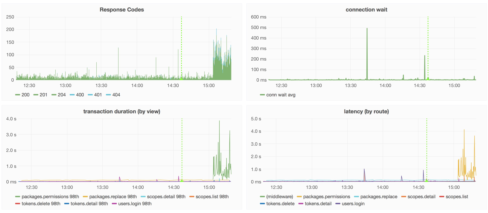

# [fit] monitoring
# [fit] the __npm__ registry
# [fit] on a budget

---


# [fit] C J Silverio
## [fit] vp of engineering, 

## [fit] __@ceejbot__

^ How many of you have ever used npm to install something? How many of you use it daily? Yeah, that's a lot of you. I'm going to talk about how I know you can install things.

---

# [fit] let's talk __npm__
# [fit] by the numbers

^ The Twelfth Doctor will accompany us on this exploration of our numbers.

---

# [fit] 205 __million__ packages Tuesday
# [fit] __10K__ requests/sec

^ 205 million packages were downloaded on Tuesday. We're at 1 billion over the last week, and Monday was a US holiday.  That's starting to scale! Surely, CJ, you have a big team!

---

# [fit] npm is 25 people
# [fit] __4__ people run the registry

^ We have 25 people now. When we started, it was 14 million / day with 5 people. Total. Most companies with services this large got there slowly and have staff to match. Not npm. We're a hobby project gone viral-- kaboom! If you're a javascript programmer, you're probably using us.

---

# [fit] success is often
# [fit] a __catastrophe__

^ Especially when you're a hobby project, not a real company.

---

# [fit] __Twitter__ told us
# [fit] when we were down

^ ulp

---


^ This was obviously no good, and I had to fix it. I'm an engineer, not an ops person, so I had to learn how to do this.

---

# [fit] 2 questions:
# [fit] is the registry __up__?
# [fit] how well is it __performing__?

^ Two jargon words for each of those questions.

---

# [fit] is the registry up?
# [fit] __monitoring__

---

# [fit] how well is it performing?
# [fit] __metrics__

---

# [fit] __monitoring__

---

# [fit] monitoring == __pull__
# [fit] ask questions that you
# [fit] know the right answers for

---

### [fit] Is this host __up__?
### [fit] Is this cert about to __expire__?
### [fit] Is the DB replication __keeping up__?

---

# [fit] if you get the wrong answer
# [fit] somebody gets __paged__

---

# [fit] __nagios__
# [fit] state of the art in free

^ Trigger warning for web developers for the image I'm about to show.

---


^ This is awful information design. The depressing thing is it works.

---

# [fit] It's okay. We never look at it.
# [fit] It just triggers Pager Duty.

^ Breathe.

---

# [fit] nagios’s virtues:
# [fit] __reliability__ & __custom__ checks

^ is couchdb replicating? are our CDN's error rates low? Are we getting too many issues on our public issue tracker?

---

# [fit] self-healing checks
# [fit] __automate__ the fix if you can!

^ Hot budget tip! Don't involve a human. If your check can fix the bad condition, it should do so! Nobody needs to wake up.

---

# [fit] monitoring == __unit tests__
# [fit] a ratchet for continuous improvement

^ You prevent yourself from having that bug again. After every production incident, we add monitoring.

---

# [fit] monitoring tells you __what__
# [fit] it doesn't tell you __why__

^ For that you need...

---

# [fit] __metrics__

^ Metrics.

---

### [fit] Q: What's a metric?
### [fit] A: A __name__ + a __value__ + a __time__.

^ Stored in timeseries databases, which are built around the idea that you'll be fetching data based on time ranges.

---

## kinds of metrics

- counter: it happened __N__ times
- gauge: it's __Y__-sized right now
- rate: it's happening __N__ times per second
- timing: it took __X__ milliseconds to do

^ counter / gauge / rate / time

---

# [fit] metrics == __push__
# [fit] the service tells you numbers

^ sometimes surprising ones

---


^ Listen to your services.

---

# [fit] __emit__ from a service
# [fit] __store__ in timeseries db
# [fit] __query__ & graph

---

# [fit] the usual stack
# [fit] statsd ➜ graphite ➜ grafana

^ State of the art in free

---


^ This is grafana.

---


^ I didn't like the state of the art. I am fussy.

---

# __statsd__ uses UDP


---

# [fit] Q: Why not send metrics over UDP?
## [fit] A: You care about receiving them.

^ How about when your system is stressed? I'd tell you a udp joke, but I'm not sure you'd get it.

---

# just try to install __graphite__


---

# [fit] for-pay/SAAS services can do better
# [fit] but I can't afford them

---

# [fit] monitoring 400 processes right now
# [fit] 12+ GB of log data a day

^ For-pay services charge by volume, and volume is what the registry has.

---

# [fit] interlude:
# [fit] when __should__ you pay?

---

# [fit] convert the __£$€__ cost
# [fit] into engineer hours/month

^ Realistically, to get the same results, how much time would you have to spend to get the results from that service? Are you okay with the half-decent version you get doing it yourself? Are you ready to devote an engineer?

---

# [fit] pay when it's __cheaper__ than
# [fit] investing an engineer
# [fit] \(be __honest__ about the cost)

^ Here, I had a clear case of better to build.

---

## [fit] __numbat__ was born

### [fit] “How hard can it be?” I said.

^ I wrote a manifesto with block diagrams and things. It was very blue-sky. Weirdly this is pretty much what I ended up building.

---


^ Turned out okay. Been in production about 18 months.

---

## https://github.com/numbat-metrics

---

# [fit] npm’s stack
# [fit] numbat ➜ __influxdb__ ➜  grafana

^ Influx is our timeseries db.

---


^ We have a thing about cute Australian marsupials at npm. Don't ask me why.

---

```js
var Emitter = require('numbat-emitter');

var emitter = new Emitter({
    uri: 'tcp://localhost:3333',
    app: 'www',
});

process.emit('metric', { name: 'httpd.latency', value: 30 });
process.emit('metric', { name: 'disk.used.percent', value: 36 });
process.emit('metric', { name: 'heartbeat' });
```

^ Every service npm runs in production has one of these. Every host has a collector.

---

# [fit] so easy to emit a metric
# [fit] that we just do it any time
# [fit] something __interesting__ happens

---

# [fit] __4000__ metrics/sec
# [fit] from the registry

---


^ See some spikes? We flushed a cache last night!

---



^ These are not just pretty graphs! These four charts show a problem with a service we'd just started sending traffic to. Latencies shot up!

---


---


^ The answer is here, in this second screenshot from the same page of graphics. The number queries used to answer handle that route was too high-- needed a redesign behind the scenes. Which we did. We spotted a db problem before we had it. Yay metrics! But wait. There's more.

---

# [fit] metrics ➜ __alerts__

^ We've got a metrics analyzer yelling at very low latency into a slack channel when certain metrics go out of bounds. All it takes to make this happen is a little javascript.

---

# [fit] Server handling __expected__ traffic?
# [fit] Latency higher than __normal__?
# [fit] Error rate higher than __usual__?

^  Your metrics know, and can yell if you vary from it.

---

# [fit] metrics comprise a __data stream__
# [fit] send the stream to more than one place!

^ To your timeseries db. To a process that does nothing but analyze them!

---


# [fit] __anomaly__
# [fit] __detection__

^ Humans are really good at this: we are walking pattern detection engines. You looked at that chart and saw a pattern & a violation of the pattern, and you asked a question about it. My stretch goal. Big companies like Twitter & Netflix have teams bigger than my entire registry team working on this.

---

# [fit] know what your
# [fit] services are up to
# [fit] on the __cheap__

---

# [fit] what: __monitoring__
# [fit] yes/no questions

^ Bread & butter. Do not do anything else until you can answer these.

---

# [fit] why: __metrics__
# [fit] data changing over time

---

# [fit] next: __anomaly detection__
# [fit] predictions & trends

---

# [fit] __Automate.__
# [fit] Don't require humans.

^ You can do it without breaking the bank.

---


# [fit] `npm install -g npm@latest`
# [fit] __@ceejbot__ on all the things

^ npm loves you.
