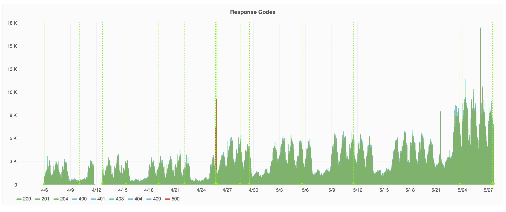

# [fit] running the
# [fit]  registry
# [fit] on a budget

---


# [fit] C J Silverio
## [fit] vp of engineering, 

## [fit] @ceejbot

^ How many of you have ever used npm to install something? How many of you use it daily? Yeah, that's a lot of you.

---  

# [fit] big numbers
# [fit] \(and some small ones)

---

# [fit] 205 million packages Tuesday
# [fit] 1 billion last week

^ 205 million packages were downloaded on Tuesday. We're at 1 billion over the last week, and Monday was a US holiday.

----

# [fit] that's respectable

^ That's starting to scale! Surely, CJ, you have a big team!

---

# [fit] npm is 25 people
# [fit] 4 of them are the registry team

^ We have 25 people now. When we started, it was 14 million / day with 5 people. Total. Most companies with services this large got there slowly and have staff to match. Not npm. We're a hobby project gone viral-- kaboom! If you're a javascript programmer, you're probably using us. Monitorama story.

---

# [fit] Success is often
# [fit] a catastrophe

---

# [fit] Solve problems on a
# [fit] shoestring budget

^ True story: I was at monitorama and (story here)

---

# [fit] keep the registry up so
# [fit] you never think about it

---

# [fit] 2 questions:
# [fit] is the registry up?
# [fit] how well is it performing?

---

# [fit] is the registry up?
# [fit] monitoring

---

# [fit] how well is it performing?
# [fit] metrics

---

# [fit] monitoring

---

# [fit] nagios
# [fit] state of the art in free

^ Trigger warning for web developers for the image I'm about to show.

---


^ This is awful information design. The depressing thing is it works.

---

# [fit] It's okay. We never look at it.
# [fit] It just triggers Pager Duty.

^ Breathe.

---

# [fit] monitoring == pull
# [fit] ask questions that you
# [fit] know the right answers for

---

### [fit] Is this host up?
### [fit] Is this cert about to expire?
### [fit] Is the DB replication keeping up?

---

# [fit] if you get the wrong answer
# [fit] somebody gets paged

---

# [fit] nagios's virtue:
# [fit] custom checks

^ is couchdb replicating? are our CDN's error rates low? Are we getting too many issues on our public issue tracker?

---

# [fit] self-healing checks
# [fit] automate the fix if you can!

^ Hot budget tip! Don't involve a human.

---

# [fit] monitoring == unit tests

^ It's an engineering ratchet: you prevent yourself from having that bug again. After every production incident, we add monitoring.

---

# [fit] monitoring tells you what
# [fit] it doesn't tell you why

^ For that you need...

---

# [fit] metrics

^ Metrics.

---

# [fit] Q: What's a metric?

---

### [fit] Q: What's a metric?
### [fit] A: A name + a value + a time.

---

## kinds of metrics

- counter: it happened __N__ times
- timing: it took __X__ milliseconds to do
- gauge: it's __Y__-sized right now
- rate: it's happening __N__ times per second

---

# [fit] metrics == push
# [fit] the service tells you numbers

---

# statsd ➜
# graphite ➜
# grafana

^ State of the art in free

---

[grafana screenshot here]

^ This is grafana.

---

# [fit] I didn't like the
# [fit] state of the art

^ I am fussy.

---

* statsd is unconfigurable & uses UDP
* graphite is [wincing gif]

---

# [fit] Q: Why not send metrics over UDP?

## [fit] A: You care about receiving them.

^ How about when your system is stressed?

---

# [fit] Also I couldn't afford it.
# [fit] we're monitoring 400 processes right now.
# [fit] we get X GB of log data a day

---

## numbat was born

### "How hard can it be?" I said.

^ I wrote a manifesto with block diagrams and things. It was very blue-sky.

---


^ Weirdly this is pretty much what I ended up building.

---

## https://github.com/numbat-metrics

---


^ We have a thing about cute Australian marsupials at npm. Don't ask me why.

---

```js
var Emitter = require('numbat-emitter');

var emitter = new Emitter({
    uri: 'tcp://localhost:3333',
    app: 'www',
});

process.emit('metric', { name: 'httpd.latency', value: 30 });
process.emit('metric', { name: 'disk.used.percent', value: 36 });
process.emit('metric', { name: 'heartbeat' });
```

^ Every service npm runs in production has one of these.

---

## emitter conveniences

* every metric has a *host* field with the hostname
* if you don't provide a *value* it defaults to *1*
* you don't need to hold onto the emitter object!
* just emit *metric* events on the `process` global

---

It's so easy to emit a metric
any time something interesting happens
that you should just do it

---

Every host has a collector.
The collector sends metrics to many destinations.
One of them is influxdb.
Grafana then draws pretty charts.

---

we put [THIS MANY] metrics data points into Influx yesterday

---



---


^ These are not just pretty graphs! These four charts show a problem with a service we'd just started sending traffic to. Latencies shot up!

---


^ The answer is here, in this second screenshot from the same page of graphics. The number queries used to answer handle that route was too high-- needed a redesign behind the scenes. Which we did. We spotted a db problem before we had it. Yay metrics!

---

# [fit] metrics ➜ alerts

^ We've got a metrics analyzer yelling at very low latency into a slack channel when certain metrics go out of bounds.

---

# [fit] anomaly detection
# [fit] the real state of the art

^ Humans are really good at this: we are walking pattern detection engines. You looked at that chart and saw a pattern & a violation of the pattern, and you asked a question about it.

---

Once again, big companies have teams bigger than the entire registry team working on this problem.


---

# [fit] what: monitoring
# [fit] yes/no questions

---

# [fit] why: metrics
# [fit] data changing over time

---

# [fit] next: anomaly detection
# [fit] predictions & trends

---

# [fit] Don't guess.
# [fit] Get data.

---

# [fit] `npm install -g npm@latest`
# [fit] @ceejbot on all the things
